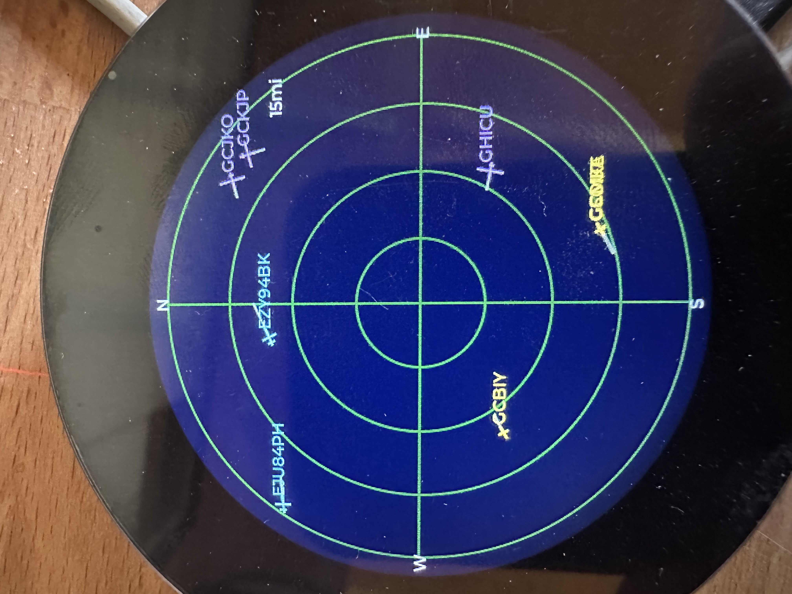
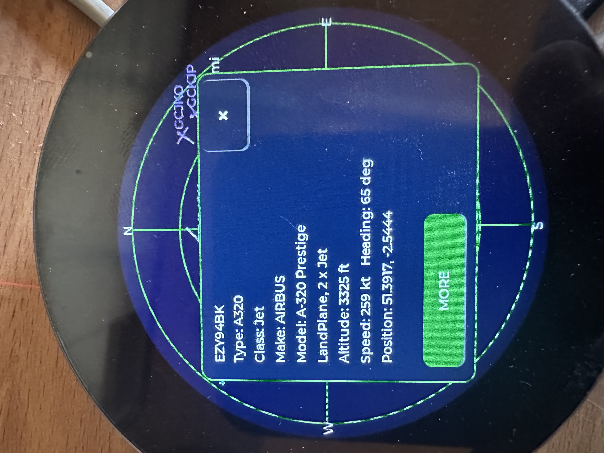
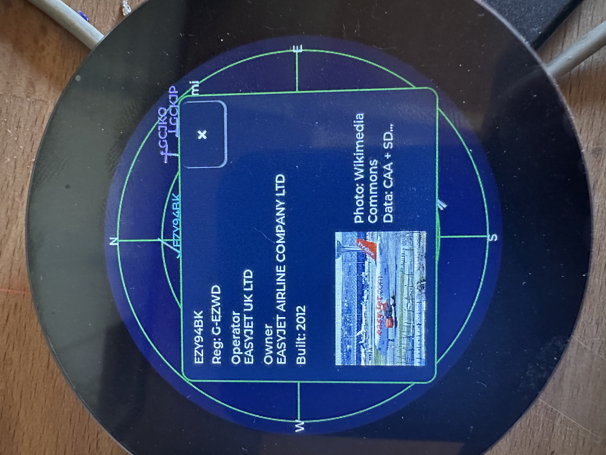

# Plane Radar

Firmware for the **Waveshare ESP32-S3-Touch-LCD-2.1** with its **2.1″ round ST7701 RGB display** (480×480). Shows a circular **ADS-B radar** around your configured location, with **WiFiManager** for first-time setup.

Based on the [MakerWorld enclosure and assembly project](https://makerworld.com/en/models/2872376-esp32-plane-radar-live-ads-b-on-a-round-display#profileId-3207083) and the [original Plane Radar firmware](https://github.com/MatixYo/ESP32-Plane-Radar/releases).

## In action

<p align="center">
  
  
  
</p>

## What it does

1. **Wi‑Fi setup** (if needed) — captive portal on AP **`PlaneRadar-Setup`**
2. **Radar** — live aircraft from [adsb.fi](https://opendata.adsb.fi/) on a sonar-style grid

After Wi‑Fi is saved, the device reconnects automatically; the radar runs in the main loop with periodic ADS-B updates (~5 s).

## Controls (BOOT, GPIO 0, active LOW)

| Action | Effect |
|--------|--------|
| **Short tap** | Cycle range preset (5 → 10 → 15 → 20 → 25 km); saved to flash |
| **Hold 3 s** | Clear Wi‑Fi, location, and units; reboot into setup portal |

During setup you can also hold BOOT at power-on to force a credential reset (same as the long press).

## Wi‑Fi setup portal

**First-time setup** (no saved Wi‑Fi):

1. Connect to **`PlaneRadar-Setup`**
2. Open **`http://plane-radar.local`** (preferred) or **`http://192.168.4.1`** — both are shown on the yellow setup screen; captive portal may open automatically
3. Set home Wi‑Fi, then save

**Reconfigure anytime** (after the device is on your network):

1. Open **`http://plane-radar.local`** or **`http://<device-ip>`** (e.g. from your router or serial log at boot)
2. Change Wi‑Fi, location, units, or runway overlay; save

The same portal runs on the setup AP and on the device’s LAN IP while connected to Wi‑Fi. mDNS hostname is `plane-radar` → **plane-radar.local** (`kPortalHostname` in `config.h`). Some clients resolve `.local` slowly; use the IP if needed.

**Custom fields** (stored in NVS):

| Field | Purpose |
|-------|---------|
| **Latitude / Longitude** | Radar center and ADS-B query position (defaults in `config.h` until set) |
| **Display distances in miles** | Ring scale label in **mi** instead of **km** (e.g. `6mi` vs `10km`) |
| **Show airport runways** | Major-airport runway overlay on the radar (off to hide) |

After a reset, the device reboots and shows the setup screen immediately (no “Connecting” loop on stale credentials).

## Radar display

### Grid

- Dark blue background, subdued green rings and crosshairs
- White **N / S / E / W** at the bezel; range label on the **east** spoke (ring 3 = ¾ of outer radius)
- White center dot

Layout and colors: `include/ui/radar_theme.h`.

### Range presets

| Ring 3 label | Outer radius (aircraft scale) |
|------------|-------------------------------|
| 5 km | ~6.7 km |
| 10 km | ~13.3 km |
| 15 km | ~20 km (default) |
| 20 km | ~26.7 km |
| 25 km | ~33.3 km |

Preset and miles/km choice persist across reboot (`planeradar` NVS namespace).

### Runways

- Major airports from OurAirports (`large_airport`); all open runway strips in range (helipads excluded)
- Teal runway lines with one ICAO label per airport (e.g. `KJFK`); toggle in the Wi‑Fi setup portal
- Update the embedded list: `python3 scripts/build_large_airports.py`

### Aircraft

- **Inside the outer ring** — red heading triangle, magenta speed vector (clipped at the ring), callsign / type / altitude tags
- **Outside the ring** (still within ADS-B fetch) — small **red dot on the screen rim** at the correct bearing (direction cue; not distance-accurate past the ring)
- **Tags** — placed toward the **center**: west (left) → tag on the **right** of the symbol; east (right) → tag on the **left**

As range decreases (or aircraft approach), targets move inward; beyond-ring dots become full symbols when they cross the outer ring.

### ADS-B

- Source: `https://opendata.adsb.fi/api/v3/`
- Fetch radius: `ui::radar::fetchRadiusKm()` — scales with the active preset to roughly the screen edge (so rim dots have data)
- Poll interval: `kAdsbFetchIntervalMs` (5 s) in `config.h`
- Ground aircraft hidden by default (`kAdsbShowGroundAircraft`)

## Configuration

Edit **`include/config.h`** for hardware and behavior:

| Area | Keys / notes |
|------|----------------|
| Portal | `kPortalApName`, `kPortalIp`, `kPortalHostname` / `kPortalHostUrl` (mDNS; needs `-DWM_MDNS` in `platformio.ini`) |
| Wi‑Fi timing | connect attempts, reconnect grace, portal timeout (`0` = no timeout) |
| BOOT | `kBootPin`, `kBootResetHoldMs`, `kBootTapMinMs` |
| Display SPI | pins, `kDisplayInvert`, `kDisplayRgbOrder`, `kDisplaySpiWriteHz` |
| Default location | `kDefaultRadarLat`, `kDefaultRadarLon` (until portal overrides) |
| ADS-B | `kAdsbFetchIntervalMs`, `kAdsbShowGroundAircraft` |

Range presets: `include/ui/radar_range.h` (`kRangePresets`).

## Project layout

```
include/
  config.h
  hardware/
    lgfx_config.hpp
    display.h
    display_font.h
  data/
    large_airports.h
  ui/
    radar_theme.h
    radar_range.h
    radar_display.h
    runway_overlay.h
    status_screens.h
  services/
    wifi_setup.h
    radar_location.h
    adsb_client.h
data/
  ui_font.vlw              — embedded smooth UI font (Noto Sans Bold)
scripts/
  build_large_airports.py
src/
  main.cpp
  data/
    large_airports_data.cpp
  hardware/
  ui/
  services/
```

## Hardware

This target is wired for the **Waveshare ESP32-S3-Touch-LCD-2.1**. Its ST7701 display, reset/CS expander, RGB bus, and backlight are initialized from the official Waveshare pinout; no additional display wiring is required.

## Build

```bash
pio run -t upload
pio device monitor
```

- PlatformIO env: **`waveshare-esp32-s3-touch-lcd-2-1`**
- Serial: **115200** baud
- USB CDC on boot enabled in `platformio.ini` for the Super Mini

### Web-flashable release image

Single `.bin` for [esptool-js](https://espressif.github.io/esptool-js/) and similar tools (ESP32-S3, 16 MB flash, at **0x0**):

```bash
chmod +x scripts/merge-firmware.sh   # once
./scripts/merge-firmware.sh
```

Writes `release/plane-radar-merged.bin`. Skip rebuild if firmware is already built:

```bash
./scripts/merge-firmware.sh --no-build
```

Or via PlatformIO only (output: `.pio/build/waveshare-esp32-s3-touch-lcd-2-1/firmware-merged.bin`):

```bash
pio run -e waveshare-esp32-s3-touch-lcd-2-1
pio run -t merge -e waveshare-esp32-s3-touch-lcd-2-1
```

Put the board in download mode (hold **BOOT**, tap **RESET**), then flash with Chrome/Edge over USB.

### CI and releases (GitHub Actions)

| Workflow | When | Output |
|----------|------|--------|
| [Build](.github/workflows/build.yml) | Push / PR to `main` | Artifact `plane-radar-waveshare-esp32-s3-touch-lcd-2-1` (merged + split `.bin` files, ~90 days) |
| [Release](.github/workflows/release.yml) | Git tag `v*` (e.g. `v1.0.0`) | GitHub Release asset `plane-radar-v1.0.0.bin` + `.sha256` |

To ship a version users can download:

```bash
git tag v1.0.0
git push origin v1.0.0
```

The release workflow builds firmware in CI and attaches the merged image to the release. Download from **Releases** on GitHub, then flash at **0x0** (ESP32-S3, 16 MB).

## Dependencies

- [LovyanGFX](https://github.com/lovyan03/LovyanGFX)
- [WiFiManager](https://github.com/tzapu/WiFiManager)
- [ArduinoJson](https://github.com/bblanchon/ArduinoJson)
